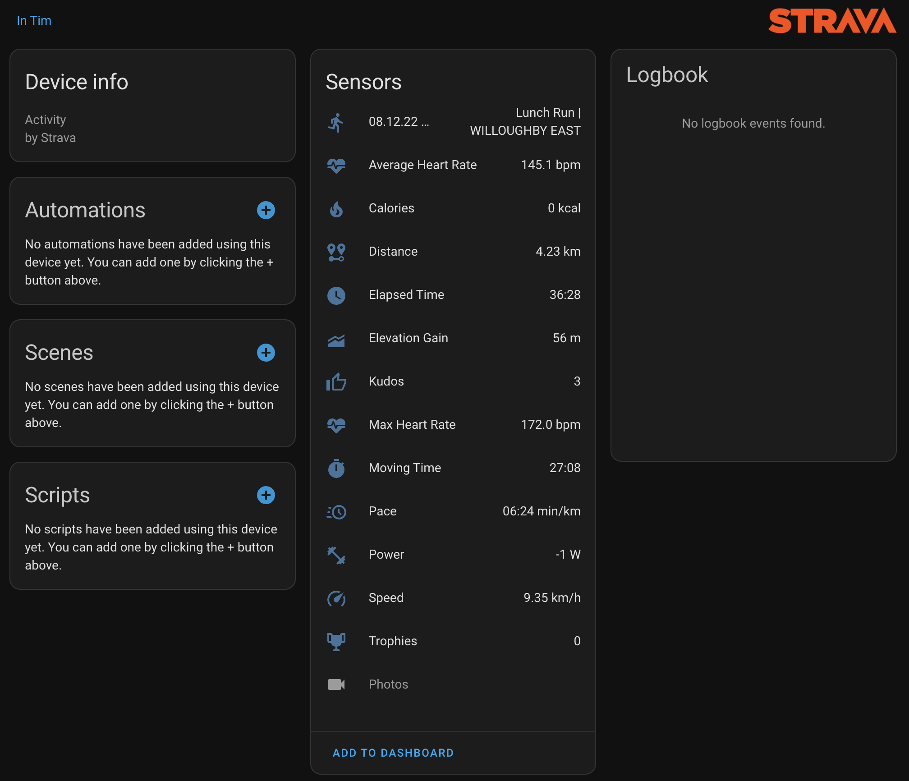
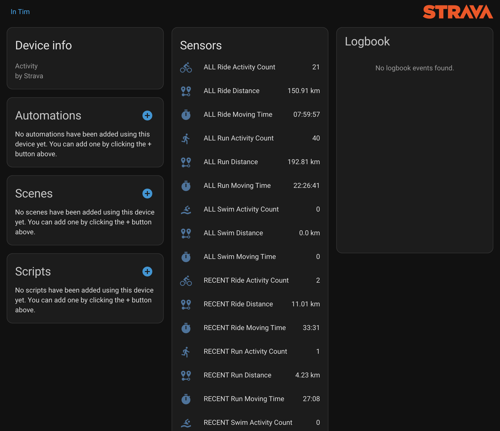

# Strava Connect for Home Assistant

Strava Connect lets you bring your latest Strava activities and athlete stats directly into Home Assistant. The integration
provides a rich set of entities that you can use to power dashboards, automations, and notifications.

## Important note

When configuring the Strava API application, set the **Authorization Callback Domain** to **my.home-assistant.io**.

## Features

- Access **up to 10 of your most recent Strava activities**.
- Retrieve recent (4 weeks), year-to-date, and all-time **summary statistics** for run, ride, and swim activities.
- Display **recent Strava photos** in a Home Assistant camera entity.
- Toggle between **metric and imperial** distance units.
- Automatically refresh entities whenever new activities are added, edited, or removed on Strava.
- Expose **13 detailed sensor entities per activity**, ready for dashboards and automations.
- Monitor the lifetime mileage of your **shoes and bikes** and adjust activity gear with a dedicated service.
- Represent every **Strava shoe as a Home Assistant device** complete with lifetime distance sensors and status flags.

Each activity is represented as its own device in Home Assistant with the following sensors:

- Date & Title
- Sport type
- Location
- Start geo coordinates
- Strava activity link
- Commute flag
- Private flag
- Elapsed Time
- Moving Time
- Pace
- Speed
- Distance
- Average Heart Rate
- Max Heart Rate
- Calories
- Average Cadence
- Elevation Gain
- Power
- Kudos
- Trophies

## Installation

### 1. Enable remote access for Home Assistant

Strava must be able to reach your Home Assistant instance through a public URL. Follow the
[Home Assistant remote access documentation](https://www.home-assistant.io/docs/configuration/remote/) to expose your instance.
If you use **Nabu Casa**, perform the configuration from your cloud URL (`Configuration` → `Home Assistant Cloud`).

### 2. Obtain Strava API credentials

Visit [Strava API settings](https://www.strava.com/settings/api) and create an application. After completing the wizard, note the
**Client ID** and **Client Secret**. Set the Authorization Callback Domain to **my.home-assistant.io**. When Strava asks for
permissions, enable the `read`, `profile:read_all`, `activity:read_all`, and `activity:write` scopes so that Home Assistant can
keep your gear assignments in sync.

### 3. Add Strava Connect via HACS

1. Install [HACS](https://hacs.xyz/docs/setup/download) if you have not done so yet.
2. Add your repository to HACS. You can use the following shortcut, replacing `your-username` if required:
   
3. Download the latest version of Strava Connect from HACS.
4. Restart Home Assistant.
5. Start the configuration flow:
   

### 4. Link Strava to Home Assistant

Navigate to `Settings` → `Devices & Services`, click **Add Integration**, search for **Strava Connect**, and follow the wizard.
After entering your API credentials and authorizing access, entities will be created automatically.

### Verify gear entities

Once the first sync finishes, open **Settings → Devices & Services → Strava Connect** and confirm that each shoe from your
Strava profile appears as its own device. Every shoe exposes a `Distance total` sensor, `Primary`/`Retired` binary sensors, and
shared attributes such as brand, model, and the last activity that used it. The gear catalog sensor keeps track of how many
shoes Home Assistant knows about and lists their current state. Mileage is tracked in kilometers internally and rendered in
your preferred units, refreshing automatically after new activities or service calls.

## Configuration options

The integration exposes several runtime options under `Settings` → `Devices & Services` → **Strava Connect** → **Configure**:

### Number of tracked activities

Adjust how many activities (1–10) should be exposed. Entities for higher-index activities are created on demand.

### Distance unit system

Choose between:

- `Default` – use the Home Assistant system units
- `Metric` – kilometers and meters
- `Imperial` – miles and feet

A Home Assistant restart ensures distance unit changes are reflected everywhere.

### Strava photo carousel

Enable or disable Strava photo imports and configure how often the camera entity rotates images (default: 15 seconds).

### geocode.xyz API key

Provide an optional [geocode.xyz](https://geocode.xyz/) API key to avoid throttling when reverse geocoding activity locations.

## Services

Strava Connect registers the following services:

- `strava_connect.set_activity_gear` – Assign a shoe or bike to one of your recent activities. Provide the Strava activity ID
  and the desired gear ID from your athlete profile. After updating the gear, the integration refreshes entities automatically so
  your dashboards stay in sync.
- `strava_connect.refresh_gear` – Request an immediate refresh of the cached athlete and gear data. Use this when you make
  changes directly on Strava and want the updated shoe mileage or retirement status right away.

## Events

Each time Strava Connect detects updated gear mileage it fires a `strava_connect_gear_updated` event that includes the gear
ID, current distance in kilometers, and the last activity that touched the gear. Automations can listen for this event to
schedule maintenance reminders or notifications when specific shoes cross a mileage threshold.

## Next steps before opening a pull request

Before you publish changes or try the integration in a production Home Assistant instance, take a moment to validate the
end-to-end flow:

1. **Run the static checks** – compiling the Python files with `python -m compileall custom_components/strava_connect` catches
   stray syntax errors early.
2. **Exercise the config flow in a dev environment** – spin up Home Assistant in a container or VM, add the integration through
   Settings → Devices & Services, and confirm that the OAuth redirect finishes with the `read`, `profile:read_all`,
   `activity:read_all`, and `activity:write` scopes listed in the Strava consent dialog.
3. **Verify entities and services** – after the initial sync completes, confirm that the activity sensors, gear mileage sensors,
   shoe devices, and both the `strava_connect.set_activity_gear` and `strava_connect.refresh_gear` services all return data and
   accept service calls.
4. **Test the webhook refresh** – trigger a new activity in Strava (or edit an existing one) and ensure Home Assistant updates the
   matching entities without a manual refresh.

If those checks pass you are ready to open a pull request or deploy the integration into your main Home Assistant instance.

## Credits

Strava Connect stands on the shoulders of the Home Assistant community and earlier Strava integrations released under the MIT
License. This distribution repackages and modernizes that work under a new name and maintainer.
